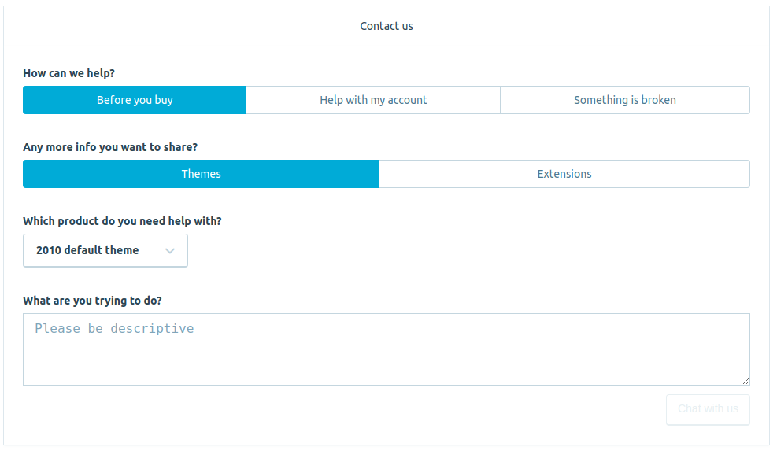
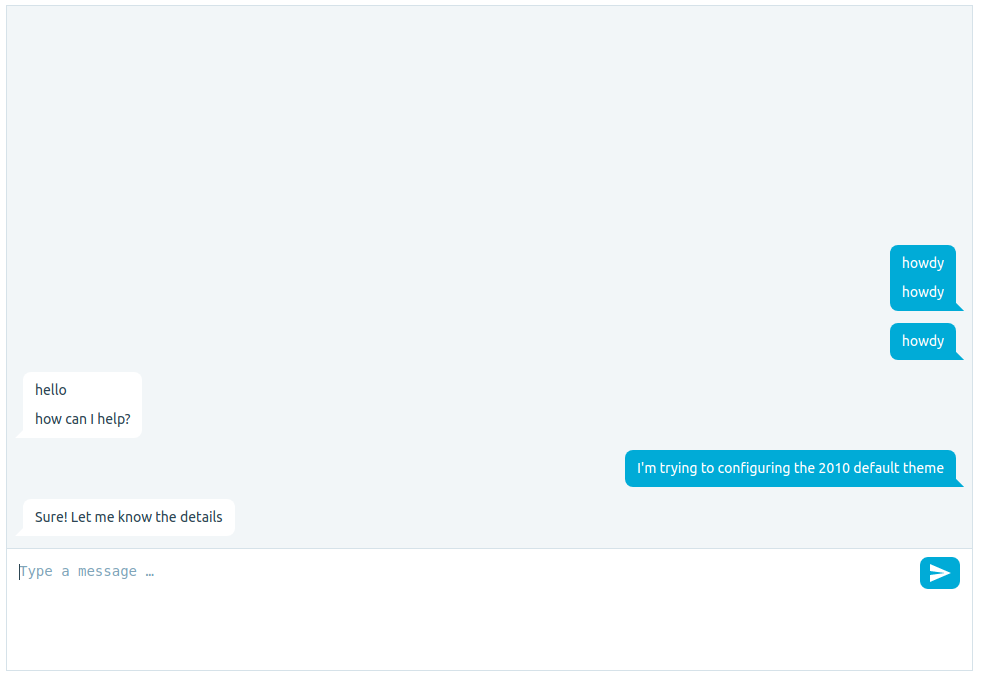
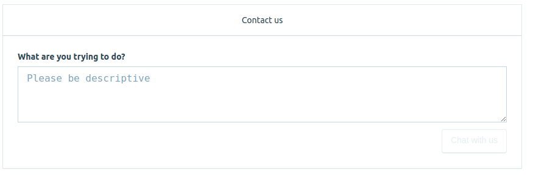
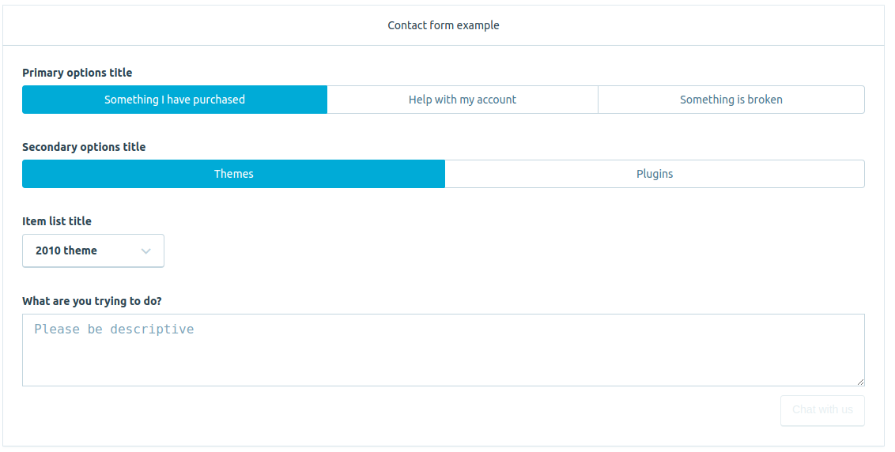
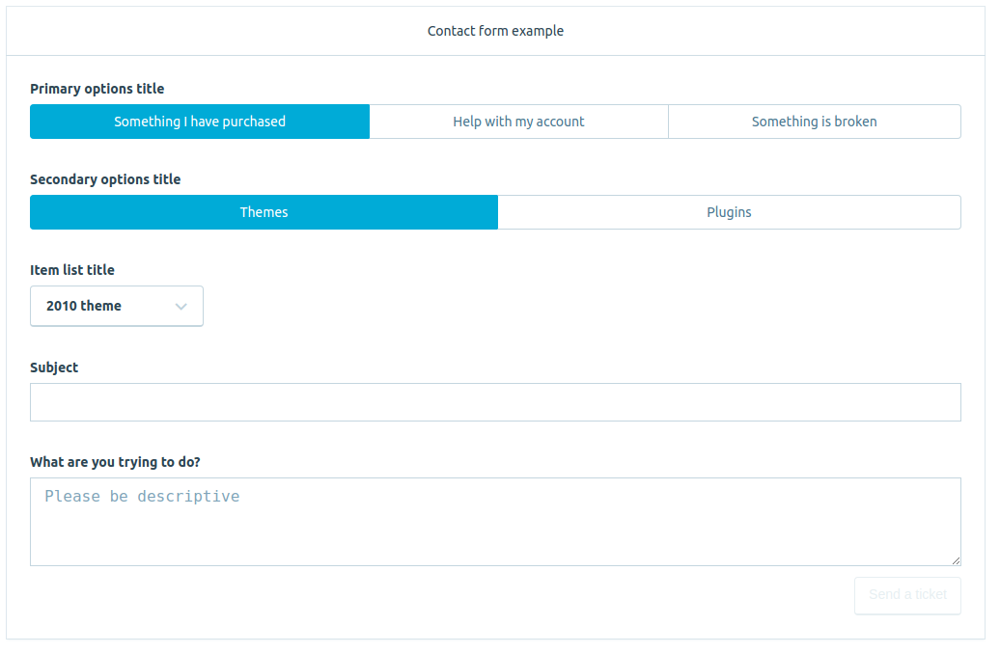

# API

* Init settings
	* authentication
	* canChat
	* entry
	* entryOptions
	* groups
	* nodeId
	* plugins
	* theme
* Examples
	* Default
	* With titles and primary, secondary, and itemList menus
	* With conditional secondaryOptions and itemList
	* Configure when to offer chat
	* Fallback ticket when there is no chat

## Init Settings

Happychat can be configured by a settings object on initialization

	Happychat.open( settings );

with the following top-level properties:

| Key | Value | Required | Default | Description |
| --- | --- | --- | --- | --- |
| `authentication` | object | Mandatory | `null` |  Configures Happychat authentication. See details below. |
| `canChat` | bool | Optional | `true` | Whether the user can be offered chat or not. |
| `entry` | string | Optional | `ENTRY_FORM` | What should be rendered as the first entry point for Happychat. Valid values are `ENTRY_FORM` (renders the contact form) `ENTRY_CHAT` (renders the chat form). |
| `entryOptions` | object | Optional | `{}` | Configures Happychat entry points. See details below. |
| `groups` | array | Optional | `[WP.com]` | What group the chat session should be routed to. Valid values are `WP.com`, `woo`, and `jpop`. |
| `nodeId` | string | Mandatory | `null` | The id of the HTMLNode where Happychat will be rendered. |
| `plugins` | object | Optional | `{}` | Configuration for the plugins you want to activate. See details below.  |
| `theme` | string | Optional | `null` | The theme to use. Valid values are the group names. |
| `cssDir` | string | Optional | `null` | The URL prefix for the folder that contains the happychat CSS files (allows serving from other than widgets.wp.com) |

### authentication

Happychat currently supports two authentication mechanisms ([more info](./src/lib/auth/README.md)):

* Via WordPress.com OAUth token, used in the standalone example.
* Via a proxy iframe that send requests to WordPress.com, used in Calypso.

How to configure authentication via OAUth token:

	Happychat.open( {
		authentication: {
			type: 'wpcom-oauth-by-token',
			options: {
				token: <WordPress.com OAUth access token>
			},
		},
	} );

How to configure authentication via proxy iframe:

	Happychat.open( {
		authentication: {
			type: 'wpcom-proxy-iframe',
			options: {
				proxy: <WordPress.com proxy object>
			},
		},
	} );

#### Connecting to alternate socket servers

If you want to connect to another socket server (like a staging or local) you can pass `authentication.options.happychatUrl`, for example:

	Happychat.open( {
		authentication: {
			type: ...,
			options: {
				happychatUrl: 'http://localhost:3232/customer',
				...
			},
		},
	} );

### canChat

Whether the user can be offered chat or not. If this property is false, no chat will be offered. This can also be configured per option, see `entryOptions` below.

### entry

The Happychat library provides two main interfaces: a contact form, and a chat form. By default, it'll show the contact form and it will render the chat form on clicking the form submit button. The contact form main behavior can be changed through the `entryOptions` prop.

Contact form:



Chat form:



### entryOptions

The `entryOptions` property allows for configuring the text and behavior or Happychat entry point.

| Key | Value | Default | Description |
| --- | --- | --- | --- |
| `formTitle` | string | `Contact form` | Title of form. |
| `primaryOptionsTitle` | string | `How can we help` | Title of primary options menu. |
| `primaryOptions` | array | `[]` | Contains the options to be shown in the primary menu. They'll be rendered either as a segmented control or a dropdown depending on the window width. If not provided, this section won't be shown. |
| `secondaryOptionsTitle` | string | `Any more info you want to share?` | Title of secondary options menu. |
| `secondaryOptions` | array | `[]` | Contains the options to be shown in the secondary menu. They'll be rendered either as a segmented control or a dropdown depending on the window width. If not provided, this section won't be shown. |
| `itemListTitle` | string | `Which product do you need help with?` | Title of item list menu. |
| `itemList` | array | `[]` | Contains the options to be shown in the item list menu. They'll be rendered as a dropdown. If not provided, this section won't be shown. |
| `openTextFieldTitle` | string | `What is the URL of your site?` | Title for the textfield component. |
| `openTextField` | object | `{}` | Contains conditions under which to show the text field. |
| `openTextAreaTitle` | string | `Any more info you want to share?` | Title for the textarea component. |
| `openTextArea` | object | `{}` | Contains conditions under which to show the text area.|
| `buttonText` | object | `{'ticket': "Send a ticket", 'chat': "Chat with us"}` | Contains the text to show for the two allowed states: offer ticket or chat. |
| `defaultValues` | object | `{}` | Configures default values for the form. |
| `fallbackTicket` | object | `{}` | Configures a default route that Happychat will use to offer ticket support as a fallback when chat is not available. |

**primaryOptions**

Every option is an object that needs to have the `value` and `label` props. Values within a menu need to be unique; the labels will be shown in the UI. Both need to be strings.

In addition to these, an option may declare two more optional properties:

* `canChat` - boolean, true by default. If `canChat` is set to false, Happychat won't let to start a chat session when this option is selected.
* `description`  - array of paragraphs, none by default. For any element in `description`, a HTML paragraph will be created below the component.

For example:

		{
			value: 'themes',
			label: 'Themes',
			canChat: false,
			description: [
				'There is no chat available for Themes.',
				'Find themes <a target="_parent" href="http://wordpress.com/themes">here</a>.'
			]
		}

when this option is selected chat won't be offered, and two messages (in different paragraphs) will be shown below the component.

**secondaryOptions**

In addition to the `value`, `label`, `canChat`, and `description` properties, the options in this section can define a `primary` option.

`primary` is an array that contains values of the options present in the `primaryOptions` section. When the selected primary option is any of the items from this array, the secondary option will be rendered - otherwise it won't be shown. If the option doesn't have a primary property, it'll be always rendered.

For example:

	{ value: 'themes', label: 'Themes', primary: [ 'before-buy', 'my-account' ] }

this option will only be shown when the value of the selected primary option is 'before-buy' or 'my-account'.

**itemList**

In addition to the `value`, `label`, `canChat`, `description`, and `primary` properties, the options in this section can define a `secondary` option.

The `secondary` property works the same way that the `primary` one but taking into account the selected secondary option instead.

For example:

	{ value: 'themes', label: 'Themes', primary: [ 'before-buy' ], secondary: [ 'themes' ] }

this option will only be shown when the value of the selected primary option is `before-buy` and the values of the selected secondary option is `themes`.

**openTextField / openTextArea**

Can define `primary` and `secondary` options that control when to show this field. The open text fields can also have a boolean `isRequired` option, which signals whether the field is required to be able to submit the form. By default, its value is false.

For example:

	{ primary: [ 'before-buy' ], secondary: [ 'themes' ], isRequired: true }

the field will only be shown when the value of the selected primary option is `before-buy` and the values of the selected secondary option is `themes`. If it's void, the submit button will be disabled.

**buttonText**

Allows the host to customize the text to bo shown in the form button. It can have two states: either send a ticket or start a chat. By default it'll show `Send a ticket` and `Chat with us`.

For example:

	{'ticket': "Create ticket", 'chat': "Start chat"}

**defaultValues**

If provided, this object contains default values for the `primaryOptions`, `secondaryOptions`, and `itemList`.

For example:

	{ primary: 'before-buy', secondary: 'themes', item: '2011' }

will make the form to be pre-loaded with these options by default.

**fallbackTicket config options**

The contact form can create a chat session or route the request to a specified endpoint. Here's how to configure it:

* `url`: URL endpoint where Happychat will make a XHR request with the form data. If no `url` is provided, the fallbackTicket feature will be disabled.
* `headers`: additional HTTP request headers to be sent along the request. This allows for hooking WordPress nonces into the request, for example. None by default.
* `method`: HTTP Request method to use. `POST` by default.
* `parseResponse`: a function callback that will be passed the response to the request and should return the content to be displayed by Happychat (can be HTML or plain text).
* `msgTimeout`: the message to be shown in case the request times out. `Request timed out, it was not successful.` by default.
* `msgInFlight`: the message to be shown while the request is in flight. `Sending request...` by default.

The request payload will be a JSON object containing all entryOptions properties and:

* primarySelected: the selected primary option,
* secondarySelected: the selected secondary option,
* itemSelected:	the selected item option,
* subject: the subject's value,
* message: the message's value,
* openTextAreaValue: the openTextArea's value,
* openTextFieldValue:	the openTextField's value,

For example:

	{
		url: '/create-ticket',
		headers: {
			'X-Test-Header': 'Savoury butter is the best breakfast',
		},
		parseResponse: function( response ) {
			return JSON.parse( response ).data;
		},
		msgInFlight: 'Ticket is being created...',
		msgTimeout: 'Could not create the ticket, the server did not respond in time'
	}

will send a HTTP POST request to the '/create-ticket' endpoint, including a `X-Test-Header`. Upon receiving the response, the contents will be converted to an object and the `data` key will be passed to Happychat as a message to render.

### groups

Currently, Happychat can connect customers to any of these groups:

| Group | Key to use |
| --- | --- | --- | --- | --- |
| WordPress | `WP.com` |
| WooCommerce | `woo` |
| Jetpack | `jpop` |

### nodeId

The Happychat library will create an iframe within the HTML node provided by this id.

### plugins

_Note: This is an experimental feature!_

When you want to activate a plugin, send a configuration object for the plugin keyed on the plugin's name. For example:

```
plugins: {
	sibyl: {
		site: "en.support.wordpress.com",
	}
}
```

This will activate the Sibyl plugin, and the plugin will be passed the `site` configuration value. Each plugin has its own configuration options.

### theme

The UI theme to use. By default it'll be used the theme that's linked to the chat group (see `groups` above), but if this property is present it'll be overriden.

## Examples

### Default

Settings:

	Happychat.open( { nodeId: <HTML Node ID> } );

will render this form:



### With titles and primary, secondary, and itemList menus

Settings:

	Happychat.open( {
		nodeId: <HTML Node Id>,
		entryOptions: {
			formTitle: 'Contact form example',
			primaryOptionsTitle: 'Primary options title',
			primaryOptions: [
				{ 'value': 'purchase', 'label': 'Something I have purchased' },
				{ 'value': 'account', 'label': 'Help with my account' },
				{ 'value': 'broken', 'label': 'Something is broken' },
			],
			secondaryOptionsTitle: 'Secondary options title',
			secondaryOptions: [
				{ 'value': 'themes', 'label': 'Themes' },
				{ 'value': 'plugins', 'label': 'Plugins' },
			],
			itemListTitle: 'Item list title',
			itemList: [
				{ 'value': 'p1', 'label': '2010 theme' },
				{ 'value': 'p2', 'label': '2011 theme' },
				{ 'value': 'p3', 'label': 'Jetpack' },
				{ 'value': 'p4', 'label': 'WooCommerce' },
			],
	} );



### With conditional secondaryOptions and itemList

Settings:

	Happychat.open( {
		nodeId: <HTML Node Id>,
		entryOptions: {
			formTitle: 'Contact form example',
			primaryOptionsTitle: 'Primary options title',
			primaryOptions: [
				{ 'value': 'purchase', 'label': 'Something I have purchased' },
				{ 'value': 'account', 'label': 'Help with my account' },
				{ 'value': 'broken', 'label': 'Something is broken' },
			],
			secondaryOptionsTitle: 'Secondary options title',
			secondaryOptions: [
				{ 'value': 'themes', 'label': 'Themes', primary: [ 'purchase', 'broken' ] },
				{ 'value': 'plugins', 'label': 'Plugins', primary: [ 'purchase', 'broken' ] },
				{ 'value': 'password', 'label': 'Change password' },
				{ 'value': 'delete', 'label': 'Delete account' },
			],
			itemListTitle: 'Item list title',
			itemList: [
				{ 'value': 'p1', 'label': '2010 theme', secondary: [ 'themes' ] },
				{ 'value': 'p2', 'label': '2011 theme', secondary: [ 'themes' ] },
				{ 'value': 'p3', 'label': 'Jetpack', secondary: [ 'plugins' ] },
				{ 'value': 'p4', 'label': 'WooCommerce', secondary: [ 'plugins' ] },
			],
	} );


### Configure when to offer chat

Using the form in the previous example, we can configure when to offer chat by using the `canChat` property per option - note that if the `canChat` global property is set to false, we'll never offer chat for that user.

For example, for these settings:

	Happychat.open( {
		nodeId: <HTML Node Id>,
		entryOptions: {
			formTitle: 'Contact form example',
			primaryOptionsTitle: 'Primary options title',
			primaryOptions: [
				{ 'value': 'purchase', 'label': 'Something I have purchased' },
				{ 'value': 'account', 'label': 'Help with my account', 'canChat': false },
				{ 'value': 'broken', 'label': 'Something is broken' },
			],
			secondaryOptionsTitle: 'Secondary options title',
			secondaryOptions: [
				{ 'value': 'themes', 'label': 'Themes' },
				{ 'value': 'plugins', 'label': 'Plugins', canChat: false },
			],
			itemListTitle: 'Item list title',
			itemList: [
				{ 'value': 'p1', 'label': '2010 theme' },
				{ 'value': 'p2', 'label': '2011 theme', 'canChat': false },
				{ 'value': 'p3', 'label': 'Jetpack' },
				{ 'value': 'p4', 'label': 'WooCommerce' },
			],
	} );

If any of `Help with my account` (primary menu), `Plugins` (secondary menu) or `2011 theme` (itemList menu) is selected no chat will be offered - no matter whether there is actual chat availability in the system.

### Fallback ticket when there is no chat

In some cases, we'd want to offer a fallback option when chat is not available. Use the `fallbackTicket` prop for this. When chat is not available, the form will show an additional "Subject" field and the submit button will change to "Send a ticket".

	Happychat.open( {
		nodeId: <HTML Node Id>,
		entryOptions: {
			formTitle: 'Contact form example',
			primaryOptionsTitle: 'Primary options title',
			primaryOptions: [
				{ 'value': 'purchase', 'label': 'Something I have purchased' },
				{ 'value': 'account', 'label': 'Help with my account', 'canChat': false },
				{ 'value': 'broken', 'label': 'Something is broken' },
			],
			secondaryOptionsTitle: 'Secondary options title',
			secondaryOptions: [
				{ 'value': 'themes', 'label': 'Themes' },
				{ 'value': 'plugins', 'label': 'Plugins', canChat: false },
			],
			itemListTitle: 'Item list title',
			itemList: [
				{ 'value': 'p1', 'label': '2010 theme' },
				{ 'value': 'p2', 'label': '2011 theme', 'canChat': false },
				{ 'value': 'p3', 'label': 'Jetpack' },
				{ 'value': 'p4', 'label': 'WooCommerce' },
			],
			fallbackTicket: {
				'url': '/create-ticket'
			}
		} );


